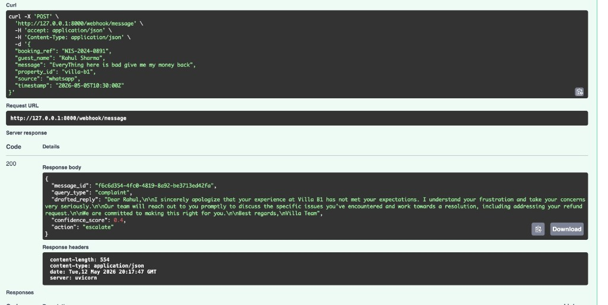

# Nistula Technical Assessment — Guest Message AI Backend

Small FastAPI service that accepts guest messages from multiple channels, normalises them, classifies the intent, pulls mock property context, asks Claude for a draft reply, scores confidence, and recommends an action (`auto_send` / `agent_review` / `escalate`). Part 2 adds a PostgreSQL schema for a future unified inbox (no DB wired in Part 1).

---

## Tech stack

| Layer | Choice |
|--------|--------|
| API | **Python 3** + **FastAPI** |
| Validation | **Pydantic** (request/response models) |
| HTTP client | **httpx** (async call to Anthropic) |
| Config | **python-dotenv** (`.env` for secrets) |
| Server | **Uvicorn** |
| LLM | **Anthropic Messages API** (Claude) |
| DB (design only) | **PostgreSQL** — see `schema.sql` |

---

## Quick setup

1. **Clone and enter the project**

   ```bash
   cd Nitsula_TA
   ```

2. **Create a virtual environment and install dependencies**

   ```bash
   python3 -m venv .venv
   source .venv/bin/activate   # Windows: .venv\Scripts\activate
   pip install -r requirements.txt
   ```

3. **Environment variables**

   Copy `.env.example` to `.env` and fill in your Anthropic key (no quotes, no trailing spaces on lines):

   ```bash
   cp .env.example .env
   ```

   Required / important variables:

   - `CLAUDE_API_KEY` — from Anthropic Console  
   - `CLAUDE_MODEL` — e.g. `claude-sonnet-4-20250514` (must be enabled for your account)  
   - Optional: `CLAUDE_API_URL`, `CLAUDE_MAX_TOKENS`, `CLAUDE_TIMEOUT_SECONDS` (see `.env.example`)

   **Billing:** if Anthropic returns 400 with “credit balance too low”, add credits under Plans & Billing — the API is working; the account is blocked until then.

4. **Run the API**

   ```bash
   uvicorn app.main:app --reload
   ```

5. **Try it**

   - Open **http://127.0.0.1:8000/docs** (Swagger UI).  
   - `POST /webhook/message` with a JSON body (see sample below).  
   - You can paste a screenshot of a successful Swagger response here in the repo (e.g. save as `docs/swagger-response.png` and link it in your submission zip) — reviewers like seeing one real 200 response.

---

## API overview

**`POST /webhook/message`**

Accepts:

```json
{
  "source": "whatsapp",
  "guest_name": "Rahul Sharma",
  "message": "Is the villa available from April 20 to 24?",
  "timestamp": "2026-05-05T10:30:00Z",
  "booking_ref": "NIS-2024-0891",
  "property_id": "villa-b1"
}
```

Returns (shape required by the brief):

```json
{
  "message_id": "…uuid…",
  "query_type": "pre_sales_availability",
  "drafted_reply": "Hi Rahul! …",
  "confidence_score": 0.9,
  "action": "auto_send"
}
```

`drafted_reply` is JSON-escaped (you will see `\n` in raw JSON); that is normal.

**Errors (on purpose):**

- Missing/invalid body → **422** (Pydantic).  
- Unknown `property_id` (no mock context) → **404**.  
- Missing `CLAUDE_API_KEY` → **503**.  
- Anthropic error (e.g. 400 credits/model) → **502** with `detail` including Anthropic’s message text when available.

---

## Architecture decisions (why it looks like this)

- **Thin route, fat services** — `webhook.py` only orchestrates. Normalisation, classification, property lookup, Claude call, and confidence/action live under `app/services/`. That matches how you’d grow this in production and is easy to explain in an interview.

- **No database in Part 1** — The brief only required a working pipeline and a separate `schema.sql`. Persisting rows would add migrations, idempotency, and failure modes without being asked yet.

- **Mock property context in code** — `property_service.py` holds the Villa B1 block you were given. In production this would come from CMS/DB/cache; here it keeps the demo self-contained.

- **Claude behind a service** — Prompt is built from `app/prompts/claude_prompt.txt`; the HTTP call is isolated so you can swap models, add retries, or log payloads in one place.

- **Explicit error surfacing** — Anthropic’s error body is appended to our `ClaudeServiceError` message so a 502 in Swagger is diagnosable (credits vs model vs payload).

---

## Query classifier — how it works (plain English)

I’m not pretending this is machine learning. It’s a **keyword pass** over the message, lowercased, in a **fixed order**: we walk a small map (complaint → availability → pricing → check-in style → special request). The **first bucket that matches any substring** wins; if nothing hits, we call it **`general_enquiry`**.

Why that order? **Complaints** often contain words like “wifi” or “available” in a negative sentence, so if we checked “wifi” before “not working”, we’d mis-label a broken wifi ticket as a casual check-in question. So **complaint is checked first**.

It’s dumb on purpose: easy to read, easy to tune, and honest in the README. The brief said simple logic is fine; the “smart” part is left to Claude **after** we’ve attached property context and a coarse label.

---

## Confidence score — what it actually means

The number is **not** “Claude’s self-confidence”. It’s our own **business-ish score for how safe it would be to auto-send without a human**.

Roughly:

- Start from a middle-ish base, then add a bit if we clearly classified the query, if the message has enough words to not feel like spam, if we got a non-empty draft back, if there’s a booking ref, and a bit extra for “factual” types (availability, pricing, check-in, special request).  
- Subtract for **vague** general enquiries and for **complaints**.  
- If the text smells **high-risk** (refund, money back, legal words, etc.), knock it down again.  
- **Hard caps:** any **complaint** is capped **below 0.60** so the score doesn’t pretend we’re happy to auto-send; severe / refund-ish complaints are capped even lower.

**Action rule (from the brief):**

- `complaint` **or** score **&lt; 0.60** → **`escalate`**  
- else score **≤ 0.85** → **`agent_review`**  
- else → **`auto_send`**

So you can get a polite draft for a complaint (for the human to edit) while the **action** still says escalate — that’s intentional.

---

## Database schema (Part 2) — design in short

All SQL is in **`schema.sql`**. The idea:

1. **`guests`** — one real-world guest.  
2. **`guest_channels`** — “this WhatsApp login / Airbnb id maps to `guest_id`” so the same person across apps is one profile.  
3. **`properties`**, **`reservations`** — catalogue + stay with `booking_ref`.  
4. **`conversations`** — a thread: guest + property, optional `reservation_id` (null before a booking exists — pre-sales).  
5. **`messages`** — **one table** for inbound and outbound so the inbox is a single timeline.  
   - **Inbound:** `query_type` + `confidence` (classifier + routing for that guest line).  
   - **Outbound:** `how_sent` (`auto_sent` / `agent_edited_then_sent` / `agent_composed`).  
   - **`channel_msg_id`** + partial unique index: when the channel gives a stable message id, **retries / duplicate webhooks** can’t insert the same inbound twice.

**Hardest trade-off:** one `messages` table means some columns are only used for inbound or outbound; we enforce that with **CHECK** constraints instead of splitting into two tables (which would make “show me the thread” queries uglier).

---

## Project layout

```
app/
  main.py                 # FastAPI app + health route
  routes/webhook.py       # POST /webhook/message
  services/               # normalisation, classifier, property, Claude, confidence
  models/                 # Pydantic request/response
  config/settings.py      # env
  prompts/claude_prompt.txt
schema.sql                # Part 2 — PostgreSQL
thinking.md               # Part 3 short answers
.env.example
requirements.txt
```

---

## For reviewers — checklist

- Run `pip install -r requirements.txt`, configure `.env`, `uvicorn app.main:app --reload`, open `/docs`.  
- Part 1 pipeline: validate → normalise → classify → property context → Claude → confidence → action.  
- Part 2: open `schema.sql` — comments in-file explain tables and the dedupe index.  
- Part 3: see `thinking.md`.  
- **Security:** never commit `.env`; `.gitignore` should exclude it (verify before push).

---

## Optional screenshot

If you add `docs/swagger-response.png` (your successful Swagger or curl output), you can link it in your write-up with:

```markdown

```

The JSON example above matches what that screenshot would show at a high level.
